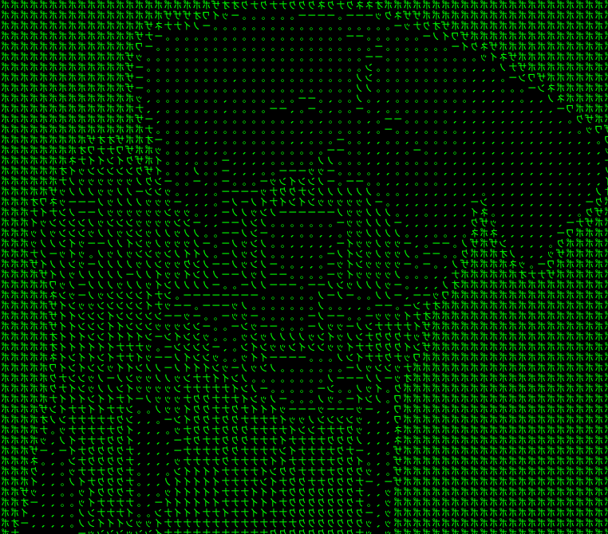

# VMDOG  
*Bypass VM-Detections including all VMProtect versions and the latest SafeExam Browser checks.*

---



---

## Introduction

VMDOG is a specialized toolkit aimed at helping you create a more stealthy VMware environment. By following these instructions, you can spoof hardware and firmware details, preventing VMware detection and allowing you to run sensitive applications that typically refuse to operate in virtualized environments.

These steps will guide you through the setup of a Windows 10 virtual machine in VMware Workstation (or a similar product), including configuration tweaks, firmware replacements from this repository.

---

## Requirements

- VMware Workstation (or another VMware virtualization product)  
- A Windows 10 installation ISO  
- [VmwareHardenedLoader](https://github.com/hzqst/VmwareHardenedLoader) for additional hardening  
- `dcontrol` (to completely disable Windows Defender)  

---

## Instructions

### Create and Configure the Virtual Machine

1. **New VM Creation**  
   Create a new virtual machine in VMware Workstation. Select **Windows 10** as the guest OS.  
   
2. **Hardware Specifications**  
   - Disk Size: Use more than 80 GB  
   - RAM: More than 4 GB (8 GB recommended)  
   - CPU Cores: More than 4 cores (6 preferred)

3. **Initial Setup**  
   Before finishing the VM creation wizard, uncheck **Power on this virtual machine after creation**.  
   Once done, click **Finish**.

   

5. **Adjusting Virtual Disks**  
   Go to **Edit virtual machine settings**:
   - Copy the Hard Disk `Disk File` path.  
   - Remove the existing Hard Disk and re-add it as a **SCSI** disk, using the previously copied path as an existing virtual disk.

6. **Switch Firmware from EFI to BIOS**  
   Open the `.vmx` file located in `C:\Users\admin\Documents\Virtual Machines\NameVM\NameVM.vmx` and change `firmware = "efi"` to `firmware = "bios"`.

7. **Replace Firmware Files**  
   Replace your VM’s current firmware files with those found in the `firmware` folder provided in this repository.
   Firmware-Folder VMware: `C:\Program Files (x86)\VMware\VMware Workstation\x64`

9. **Boot Order and ISO Configuration**  
   Power on the VM and enter BIOS setup. Make sure it boots from the disk first. If you’re installing Windows from an ISO, set the ISO as a CD/DVD device (SCSI if needed) and ensure it’s recognized.  
   If the ISO is not detected, try changing the CD/DVD to a different SCSI slot in the **Advanced** tab of the VM’s CD/DVD settings.

10. **After Windows Installation**  
   Once Windows is installed, remove the CD/DVD drive entirely from the VM settings. Do **not** install VMware Tools.

11. **Disable Windows Defender**  
   Use `dcontrol` (optional but recommended) to disable Windows Defender completely.

### Hardening with VmwareHardenedLoader

10. **Hardened Loader Setup**  
    Download and extract [VmwareHardenedLoader](https://github.com/hzqst/VmwareHardenedLoader).  
    Run the `install.bat` from the `bin` folder as Administrator.  
    After the script completes, reboot and then shut down the VM.

11. **Additional VMX Tweaks**  
    Edit the `.vmx` file again and add the following lines at the bottom:

    ```  
    hypervisor.cpuid.v0 = "FALSE"
    board-id.reflectHost = "TRUE"
    hw.model.reflectHost = "TRUE"
    serialNumber.reflectHost = "TRUE"
    smbios.reflectHost = "TRUE"
    SMBIOS.noOEMStrings = "TRUE"
    isolation.tools.getPtrLocation.disable = "TRUE"
    isolation.tools.setPtrLocation.disable = "TRUE"
    isolation.tools.setVersion.disable = "TRUE"
    isolation.tools.getVersion.disable = "TRUE"
    monitor_control.disable_directexec = "TRUE"
    monitor_control.disable_chksimd = "TRUE"
    monitor_control.disable_ntreloc = "TRUE"
    monitor_control.disable_selfmod = "TRUE"
    monitor_control.disable_reloc = "TRUE"
    monitor_control.disable_btinout = "TRUE"
    monitor_control.disable_btmemspace = "TRUE"
    monitor_control.disable_btpriv = "TRUE"
    monitor_control.disable_btseg = "TRUE"
    monitor_control.restrict_backdoor = "TRUE"
    scsi0:0.productID = "MX500"
    scsi0:0.vendorID = "Crucial"
    ```

12. **MAC Address Adjustment**  
    In the VM’s network settings, change the MAC address to something non-VMware-like (e.g., `00:19:56:25:D2:E8`). Adjust the second value if needed to avoid known VMware prefixes.

---

## Completion

Once these steps are complete, you’ll have a VM configured to better evade VMware detection, suitable for use against even the latest versions of VMProtect and SafeExam Browser.

---

## TODO

Simulating a Graphics Card and Registering a Virtual Monitor to Bypass Monitor Detection in SafeExamBrowser

---

**Credits:**  
- [VmwareHardenedLoader](https://github.com/hzqst/VmwareHardenedLoader) by hzqst - A powerful tool for hardening VMware virtual machines against detection
